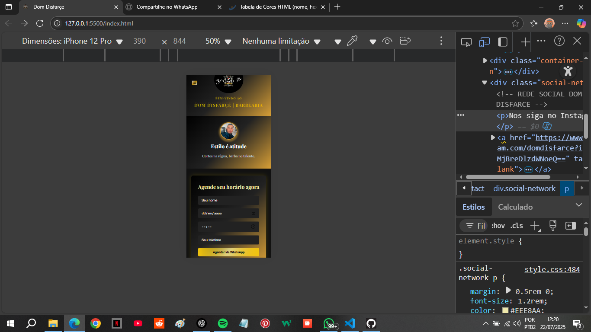
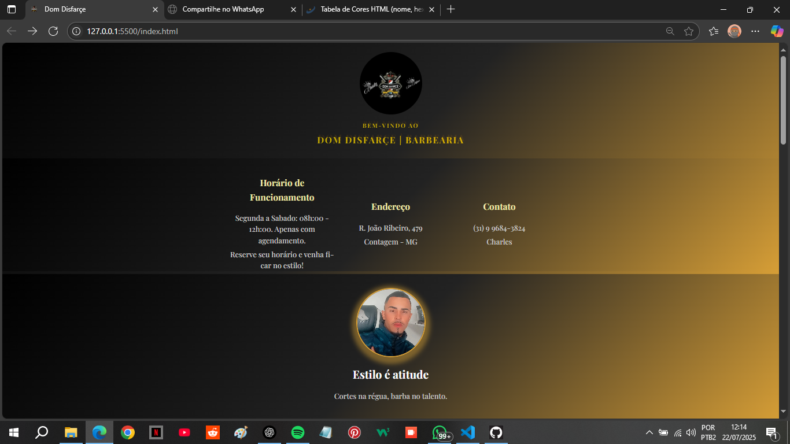
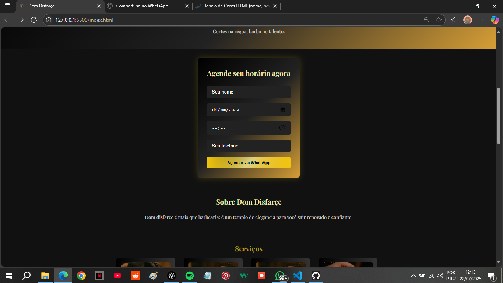
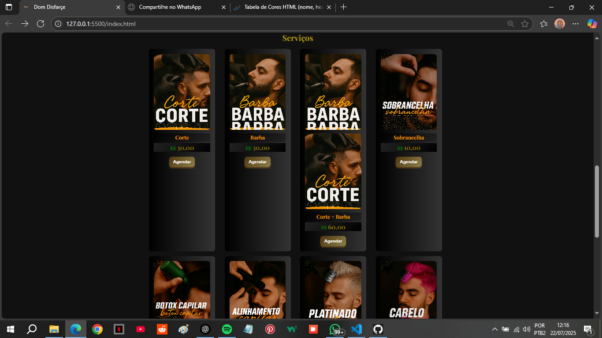
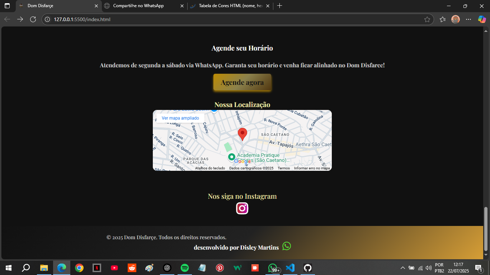

# 💈 Dom Disfarçe | Landing Page para Barbearia

Landing page *responsiva e minimalista* criada para a *Barbearia Dom Disfarçe* em Contagem, MG, com foco em *agendamentos rápidos via WhatsApp e apresentação clara de serviços*.

---

## ✂ Funcionalidades

✅ Layout *Mobile First*  
✅ Seção de serviços com botões de *agendamento direto no WhatsApp*  
✅ Rodapé com *Google Maps* para facilitar localização  
✅ *Animações sutis* e hover nos botões  
✅ Cores escuras com detalhes dourados para *transmitir elegância*

---

## 🛠 Tecnologias utilizadas

- *HTML5*
- *CSS3 (Flexbox e Grid)*
- *Font Awesome* (ícones)
- *Google Fonts* (Playfair Display)
- *JavaScript Puro* (sem frameworks) 

---

💡 Aprendizados
	•	Criação de formulário funcional usando JavaScript, capturando dados do  usuário e enviando diretamente para o WhatsApp sem backend.
	•	Uso de addEventListener e preventDefault para controle de formulários.
	•	Montagem de mensagens dinâmicas com encodeURIComponent.
	•	Integração do frontend com serviços externos (WhatsApp) de forma prática.
	•	Prática de responsividade com media queries e ajustes de layout em grid/flexbox.
	•	Deploy em GitHub Pages.

---

## 🖼 Preview

 prints do projeto: 
 
 ## Preview

